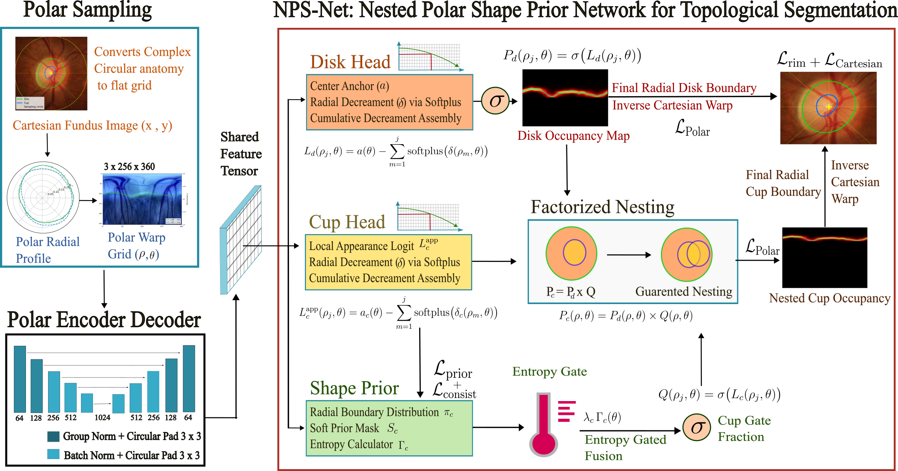

# Nested Radially Monotone Polar Occupancy Estimation: Clinically-Grounded Optic Disc and Cup Segmentation for Glaucoma Screening

\author{Rimsa Goperma, Rojan Basnet, and Liang Zhao}
\thanks{Submitted on April 2026.}
\thanks{R. Goperma, R. Basnet, and L. Zhao are with the Graduate School of Advanced Integrated Studies in Human Survivability (GSAIS), Kyoto University, Kyoto, Japan (e-mail: rimsa.goperma.53c@st.kyoto-u.ac.jp; basnet.rojan.55i@st.kyoto-u.ac.jp; liang@gsais.kyoto-u.ac.jp).}

\begin{abstract}
Valid segmentation of the optic disc~(OD) and optic cup~(OC) from
fundus photographs is essential for glaucoma screening.
Unfortunately, existing deep learning methods do not guarantee clinical
validness including star-convexity and nested structure of OD and OC,
resulting corruption in diagnostic metric, especially under
cross-dataset domain shift.
To adress this issue, this paper proposed \textbf{NPS-Net} (Nested Polar
Shape Network), the first framework that formulates the OD/OC segmentation
as \emph{nested radially monotone polar occupancy estimation}.
This output representation can guarantee the aforementioned clinical
validness and achieve high accuracy.
Evaluated across seven public datasets, NPS-Net
shows strong zero-shot generalization.
On RIM-ONE, it maintains 100\% anatomical validity
and improves Cup Dice by 12.8\% absolute over the best
baseline, reducing vCDR MAE by over 56\%. On PAPILA,
it achieves Disc Dice of 0.9438 and Disc HD95 of
2.78\,px, an 83\% reduction over the best competing method.
%\@ These results demonstrate that the proposed method can
% deliver clinical reliability much more than existing methods.
\end{abstract}



## Project Structure

```
NPS-NET/
├── config.py                    # Ablation configuration
├── README.md                    # This file
├── ablation.md                  # Ablation study details
├── run_ablation.sh              # Training launcher
├── datasets/
│   ├── dataset.py               # Data loading
│   └── Map/                     # Dataset CSV files
├── models/
│   ├── baselines/               # Baseline models
│   │   ├── vanilla.py           # Vanilla UNet
│   │   ├── attunet.py           # Attention UNet
│   │   ├── resunet.py           # Residual UNet
│   │   ├── polar_unet.py        # Polar UNet
│   │   ├── transunet.py         # Transformer UNet
│   │   ├── beal.py              # BEAL
│   │   ├── dofe.py              # DoFE
│   │   └── losses.py            # Baseline losses
│   └── nps_net/                 # NPS-Net variants
│       ├── model_b2.py          # B2: Monotone heads
│       ├── model_b3.py          # B3: + Nesting
│       └── model_b4.py          # B4: + Shape prior
├── training/
│   ├── config.py                # Training configuration
│   ├── train.py                 # Baseline training
│   ├── train_ablation.py        # Ablation training
│   ├── losses_ablation.py      # Ablation losses
│   └── dataset.py              # Training dataset
├── evaluation/
│   ├── inference.py             # Baseline inference
│   ├── inference_papila.py      # PAPILA evaluation
│   ├── inference_refuge.py      # REFUGE evaluation
│   ├── inference_combined.py   # Combined evaluation
│   ├── inference_ablation.py   # Ablation inference
│   └── inference_polar_tta_ablation.py  # Polar-TTA inference
├── checkpoints/
│   ├── baselines/               # Baseline checkpoints
│   ├── b2/                      # B2 checkpoints
│   ├── b3/                      # B3 checkpoints
│   └── b4/                      # B4 checkpoints
└── Utils/
    ├── visualize_*.py           # Visualization scripts
    ├── compute_*.py             # Computation scripts
    └── prepare_*_csv.py         # Dataset preparation
```

## Quick Start

### Training

**NPS-Net uses staged training** - B4 variant trains in 3 stages:
- Stage A (epochs 1-20): Train polar encoder + monotone heads only
- Stage B (epochs 21-30): Enable shape prior branch
- Stage C (epochs 31-80): Enable consistency loss + full optimization

```bash
# Train baseline models
python training/train.py --model vanilla
python training/train.py --model attunet

# Train NPS-Net ablation variants (handles staged training internally)
python training/train_ablation.py --variant b2
python training/train_ablation.py --variant b3
python training/train_ablation.py --variant b4
```

### Evaluation

```bash
# Baseline inference (vanilla, attunet, resunet, polar_unet, transunet, beal, dofe)
python evaluation/inference.py --model vanilla --test

# NPS-Net evaluation on external datasets
python evaluation/inference_combined.py --model npsnet --test
python evaluation/inference_papila.py --model npsnet
python evaluation/inference_refuge.py --model npsnet

# External dataset evaluation
python evaluation/inference_papila.py --model all
python evaluation/inference_refuge.py --model all

# Ablation evaluation
python evaluation/inference_ablation.py --variant b4 --test
python evaluation/inference_polar_tta_ablation.py --test
```

## Model Weights

Pre-trained weights are available on HuggingFace:

### OURS (NPS-Net)

| Variant | Download |
|---------|----------|
| NPS-Net B2 (Monotone) | [best_model.pth](https://huggingface.co/Rimsa66/nps-net/raw/main/b2/best_model.pth) |
| NPS-Net B3 (+ Nesting) | [best_model.pth](https://huggingface.co/Rimsa66/nps-net/raw/main/b3/best_model.pth) |
| NPS-Net B4 (+ Shape Prior) | [best_model.pth](https://huggingface.co/Rimsa66/nps-net/raw/main/b4/best_model.pth) |

### Baselines

| Model | Download |
|-------|----------|
| Vanilla UNet | [best_model.pth](https://huggingface.co/Rimsa66/nps-net/raw/main/baselines/vanilla/best_model.pth) |
| Attention UNet | [best_model.pth](https://huggingface.co/Rimsa66/nps-net/raw/main/baselines/attunet/best_model.pth) |
| ResUNet | [best_model.pth](https://huggingface.co/Rimsa66/nps-net/raw/main/baselines/resunet/best_model.pth) |
| PolarUNet | [best_model.pth](https://huggingface.co/Rimsa66/nps-net/raw/main/baselines/polar_unet/best_model.pth) |
| TransUNet | [best_model.pth](https://huggingface.co/Rimsa66/nps-net/raw/main/baselines/transunet/best_model.pth) |
| BEAL | [best_model.pth](https://huggingface.co/Rimsa66/nps-net/raw/main/baselines/beal/best_model.pth) |
| DoFE | [best_model.pth](https://huggingface.co/Rimsa66/nps-net/raw/main/baselines/dofe/best_model.pth) |

Or use the HuggingFace hub API in Python:

```python
from huggingface_hub import hf_hub_download

# Download NPS-Net B4
model_path = hf_hub_download(
    repo_id="Rimsa66/nps-net", 
    filename="b4/best_model.pth"
)
```

## Requirements

```
torch>=2.0
torchvision
numpy
pandas
opencv-python
scipy
scikit-learn
wandb (optional)
```

## Key Features

- **Nested Polar Representation**: Guarantees OD⊇OC (anatomical validity)
- **Monotone Polar Occupancy**: Star-convex shape via cumulative-decrement
- **Shape Prior Branch**: Learned boundary distributions with confidence gating
- **Polar-TTA**: Test-time augmentation for improved localization

## Models

| Model | Description |
|-------|-------------|
| Vanilla UNet | Standard U-Net baseline |
| Attention UNet | Attention-gated U-Net |
| ResUNet | Residual U-Net |
| PolarUNet | Polar-transformed U-Net |
| TransUNet | Transformer U-Net |
| BEAL | Boundary-enhanced Active Learning |
| DoFE | Domain-aware Feature Extraction |
| NPS-Net (B4) | Full NPS-Net with shape prior |
| NPS-Net (B5) | B4 + Polar-TTA |

